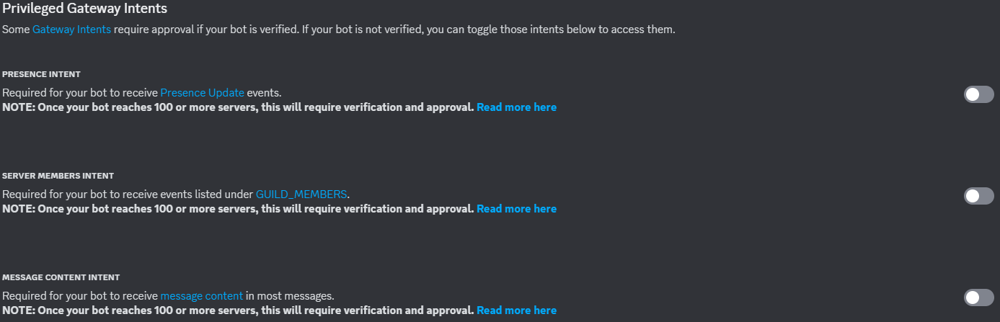
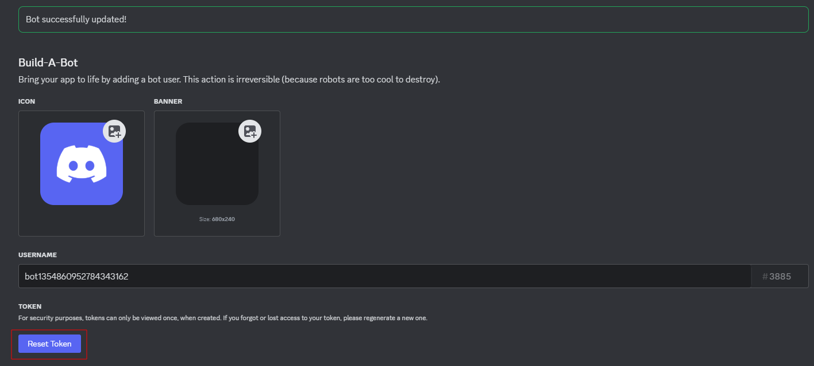

# Setting Up a Discord Bot

**_In this section we will show how to create a discord bot and install required packages for your prefer IDE_**

## Creating a Discord Bot

!!! warning "Prerequisite"

    You will need to have discord account. If you do not have an account please follow the link [`here`](https://discord.com/register)

1.  ### Go to [`Discord Developer Page`](https://discord.com/developers/applications)

2.  ### Create a new application at the Top-Right of The Page:

    

    - When promted by a name, enter the name of your bot. For our example we will call it Grockamolii.
    - Accept the terms and coniditons
    - Then press 'Create'
    <div style="text-align: center;">
        
    </div>

3.  ### Customise Your Discord Bot

    - After creation you will be in the bot interface you can focus on the left side of the screen select the `Bot` tab
    <div style="text-align: center;">
    
    </div>

    !!! info "Customization"

        You can choose images that are appropriate if use is for public use.

4.  ### Select The Intent of Your Bot

    For this Demo you will select from the following image:

    

    1. Presence Intent
    2. Server Members Intent
    3. Message Content Intent

5.  ### Create Discord bot's token

    1. You have click on the blue button `Reset Token`

    

    2. Now save your token so you can remember

    !!! warning Protect Your Token

        Make sure to keep note of your token as it give access to your Bot's key to to connect to Discord's server

!!! success

    At this point, you have successfully create A discord bot

## Setting Up Python for VSCode

Next we will start up the new porject in VSCode

!!! info "VSCode"
refers to Visual Studio Code

1. Make a new folder within a desired location

2. Open folder within VSCode

3. Install python extension

   1. Open exetension tab with the following:

      ```
      ctrl + shift + x
      ```

   2. search for python

   3. install python from Microsoft store
   <div style="text-align: center;">
   
   </div>

4. Time to start python Virtual Environment

   1. use `ctrl + shift + p` at the same time

   2. Type the following:

      ```
      Python:Select Interpreter
      ```

   3. Select the option `Create Virtual Environment`

      

   4. Select `Venv` option

   5. select your latest version python in the options

   !!! success install complete
   now you will see a new folder show up in your directory
   <br>
   

5. Install important packages

   1. make a new terminal by the following:
      ```
      ctrl + shift + `
      ```
   2. use the following command to install Discord package

      ```
      pip install discord.py
      ```

!!! success Completed Setup
Now you are ready for the next step

## Conclusion

By the end of this section, you will successfully learned the following:

- [x] How to create a Discord Bot

- [x] How to setup your IDE for Python

Great job. You can go ahead and click on the link below to move on to the next step:

**[Adding Discord Bot to server](taskTwo.md)**
