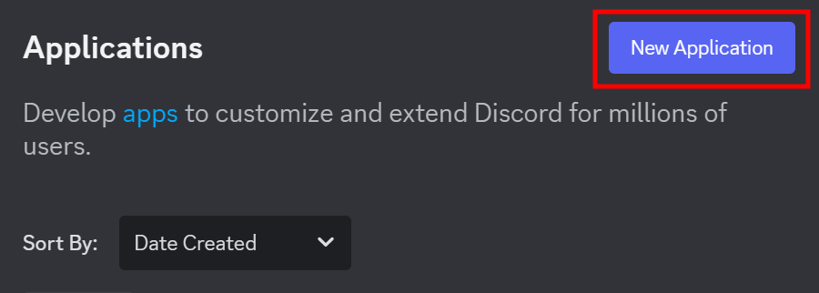
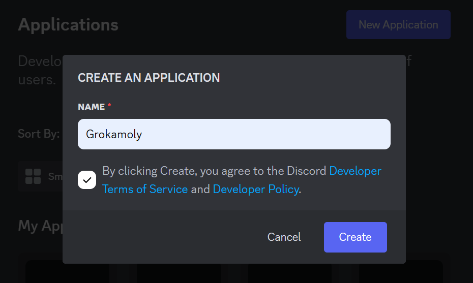
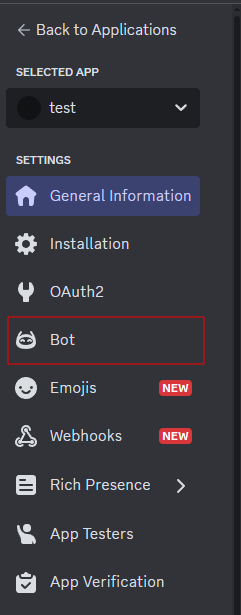
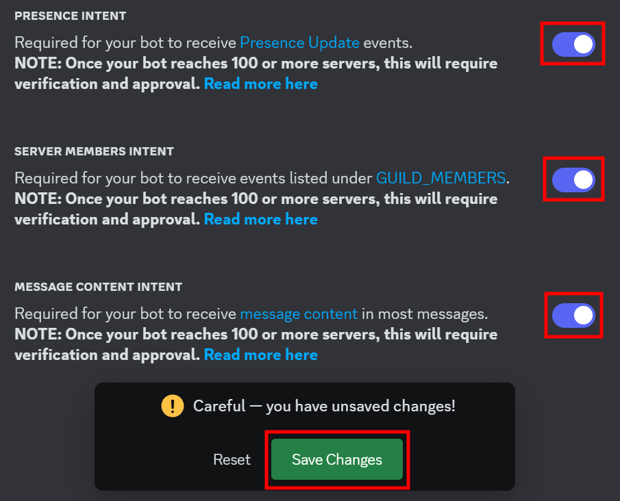
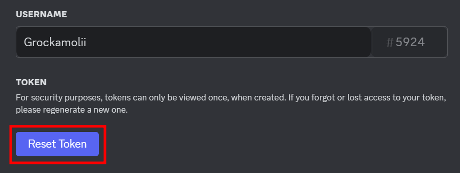
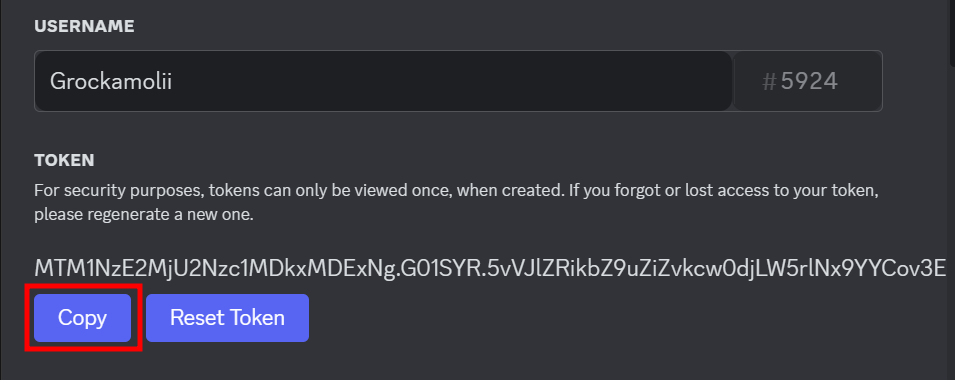
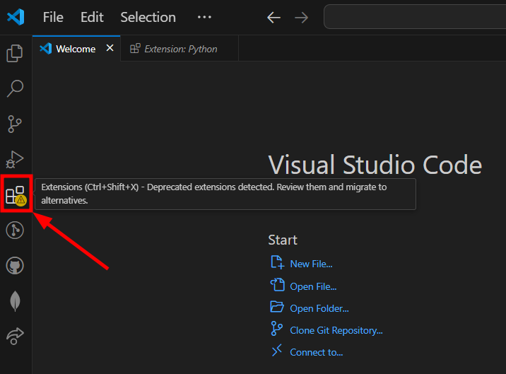
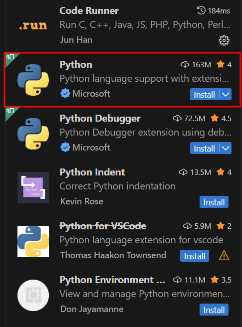
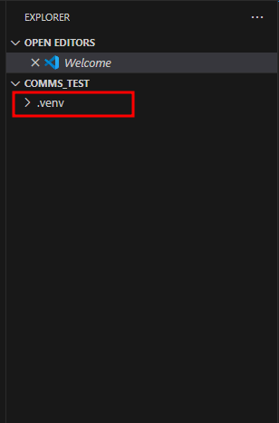

# Setting Up a Discord Bot

### _In this section we will show you:_

- [ ] How to create a discord bot and
- [ ] Set up a IDE enviroment to help you start coding your bot

??? info "What is an IDE?"

    Integrated development environment (IDE) is a software application that helps programmers develop code more efficiently. There are many options to chose from in the market, but for this demonstration we will be using a free and popular IDE called VSCode

### **Creating a Discord Bot**

!!! warning "Prerequisite"

    You will need to have discord account. If you do not have an account please follow the link [`here`](https://discord.com/register)

### Steps:

1.  Go to [`Discord Developer Page`](https://discord.com/developers/applications)

2.  Let us create a new application by pressing 'New Application' at the top-right of the page:

<div style="text-align: center;">
    
</div>

3\. When promted by a name, enter the name of your bot. For our example we will call it Grokamoly.

4\. Accept the terms and coniditons

5\. Then press 'Create'

<div style="text-align: center;">
    
</div>

---

### **Customize Your Discord Bot**

Congraduations, you've now created a bot! Now lets bring it to life by navigating to the 'Bot' tab located on the left side side of the screen

<div style="text-align: center;">

</div>

!!! info "Customization"

    You can choose images that are appropriate if use is for public use.

---

### **Select The Intent of Your Bot**

The intent delarcation is a way to tell Discord what your bot can and cannot do.

For this demo you will select from the following image:

<div style="text-align: center;">

</div>
### Activate: 
- [x] Presence Intent
- [x] Server Members Intent
- [x] Message Content Intent
- [x] Save Changes

---

### Create Discord bot's token

??? info "Token"

    The token is your bot's key to access Discord's API (Application Programing Interface). An API can be thought as a contract between how two devices communicate with each other using requests and respones.

We've just changed our intention for our bot and it needs to be updated to let Discord know.

### Steps:

1\. Click on the 'Reset Token' to update Discord's record

<div style="text-align: center;">
    
</div>

2\. After resetting, there should be a token you can now copy. Save this token in a secure place where you can access it again later

??? info "Lost or Forgotten Token"

    If you forget to copy or have lost this key, don't panic. Simply repeat step one and a new token will be generated for you

<div style="text-align: center;">
    
</div>

!!! warning "Protect Your Token!"

    Never share your token! Think of it as the key to your house. A token is a Bot's key to connect to Discord's server

!!! success

    At this point, you have successfully create a Discord bot!

    - [x] How to create a Discord Bot
    - [ ] How to setup your IDE for Python

---

## Setting Up Python in VSCode

Next lets set up our work station for coding our bot using VSCode.

!!! info "VSCode"

    Visual Studio Code

### Steps:

1. Create a folder on your desktop or your desired location and name it `reminderBot`

1. Open VSCode

1. Click on 'files' in the top left corner, naviagte to 'Open Folder', and browse till you find our folder `reminderBot`. Then open it

1. To install the Python extension click on the extention icon on the left tab or use command `ctrl + shift + x`

??? info "Python Extention"

    We need to set up an environment to translate what we want to say into computer language. For our needs, we will be using Python. In VSCode, there are a number of extentions developers have made, and Python is one of them.

   <div style="text-align: center;">
      
    </div>

5\. At the top left, there should be a search bar. Look up Python

6\. Install Python from Microsoft store

<div style="text-align: center;">
    
</div>

---

## Time to start Python Virtual

We're almost finished the set up. The last step is to create a virual enviroment for the our code. This will help protect your system, prevent conflicts and to have multiple incompatible projects running on the same system without any issues by isolating this project dependencies.

### Steps:

1.  lets open the VSCode's command promt using `ctrl + shift + p`

2.  Type the following:

    ```
    Python:Select Interpreter
    ```

3.  Select the option `Create Virtual Environment` It should be the first item

    

4.  Select `Venv` option

5.  Select the latest version Python in the options

!!! success "Install complete"

    You should now see see a new folder show up in your directory

<br>
<div style="text-align:center;">
    
</div>

6\. Install important packages

- To shortcut to terminal use the command `ctrl + shift + ~ `

- Use the following command to install Discord package

  ```
  pip install discord.py
  ```

!!! success "Completed Setup"

    Now you are ready for the next step!

---

## Conclusion

By the end of this section, you will successfully learned the following:

- [x] How to create a Discord Bot

- [x] How to setup your IDE for Python
