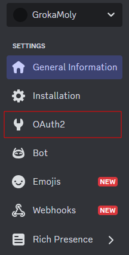
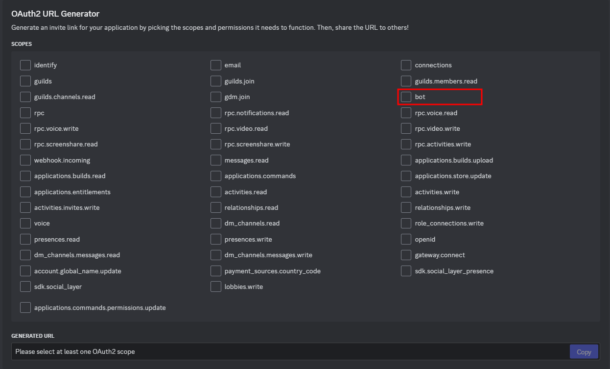
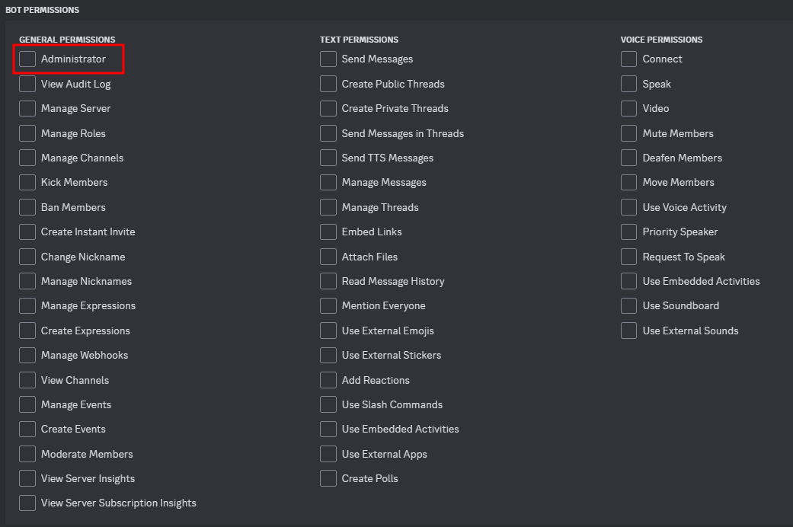
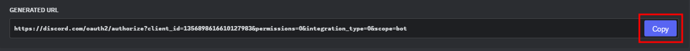
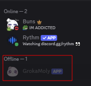
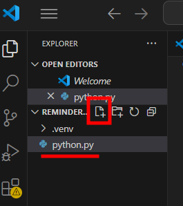

# Setting Up Discord Bot With a Server

### _In this section, we will learn:_

- [ ] How to invite your Discord bot into your server of choice and
- [ ] Test if your Discord bot is operational

## Inviting Discord Bot To a Server

1\. From current page go to `OAUTH2` page from the left-side bar

<div style="text-align: center;">
    
</div>

2\. Under 'OAuth2 URL Generator' check the `bot` option

   <div style="text-align: center;">
      
   </div>

3\. Moving to 'BOT PERMISSIONS' check the `Administrator` option

   <div style="text-align: center;">
      
   </div>

4\. Find your generated URL for your bot and copy it

   <div style="text-align: center;">
      
   </div>

5\. Paste into you prefer browser.

6\. After loading the page, it will open discord a prompt you to select your personal server of choice

   <div style="text-align: center;">
      
   </div>

7\. After select the your server, yourl bot will now appear in the server member list as offline

   <div style="text-align: center;">
      
   </div>

!!! success "Joined the server"

      Your Discord bot is now visable in your selected server

      - [x] How to invite your Discord bot into your server of choice and
      - [ ] Test if your Discord bot is operational

<br>

---

<br>

## Testing Your Discord Bot Works In Your Server

_The following steps will all be inside one file\*_

### Steps:

1\. First, in VSCode let us add a new file to our file and name it`python.py`. To do this, either click on the new file icon, or use the command `crtl + n` to create a new file

   <div style="text-align: center;">
      
   </div>

<br>

### Copy the following code into your `python.py`:

2\. Helps set up important packages we will need for this file

```python
import discord
from discord.ext import commands
```

<br>

3\. Initialize prefix for command in Discord server

```py
bot = commands.Bot(command_prefix='!', intents=discord.Intents.all())
```

<br>

4\. Add a code the displays a ready msg from the Discord bot in the terminal

```py
@bot.event
async def on_ready():
    print(f'Logged in as {bot.user.name} ({bot.user.id})')
    print('------')
```

<br>

5\. Implement a simple command program when your Discord bot will reply with `Pong!`

```py
@bot.command()
async def ping(ctx):
await ctx.send('Pong!')
```

<br>

6\. Implement a simple program that will reply to the user with a `Hello, @user` and ping to.

```py
@bot.command()
async def hello(ctx):
await ctx.send(f'Hello, {ctx.author.mention}!')
```

<br>

7\. Replace `YOUR_TOKEN_HERE` with your Discord bot's token to allow the bot to connect to discord server API

```py
bot.run('YOUR_TOKEN_HERE')
```

<br>

!!! warning "If token is invalid"

      The program crash on compile

8\. When you test it the result should look similar to this below:


!!! success "Discord Bot's responds"

      Now your Discord bot will respond to certain commands

      - [x] How to invite a Discord Bot to your server

      - [x] How to test basic programs with you Discord Bot

## Conclusion

By the end of this section, you will successfully learned the following:

- [x] How to invite a Discord Bot to your server

- [x] How to test basic programs with you Discord Bot
