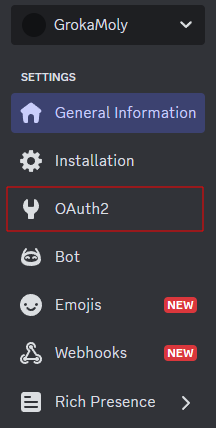
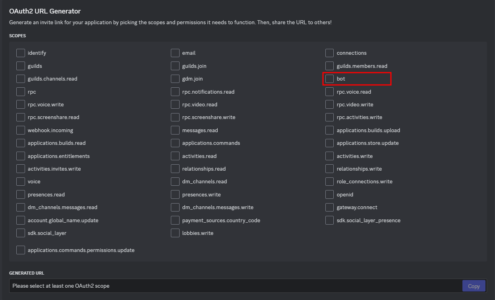
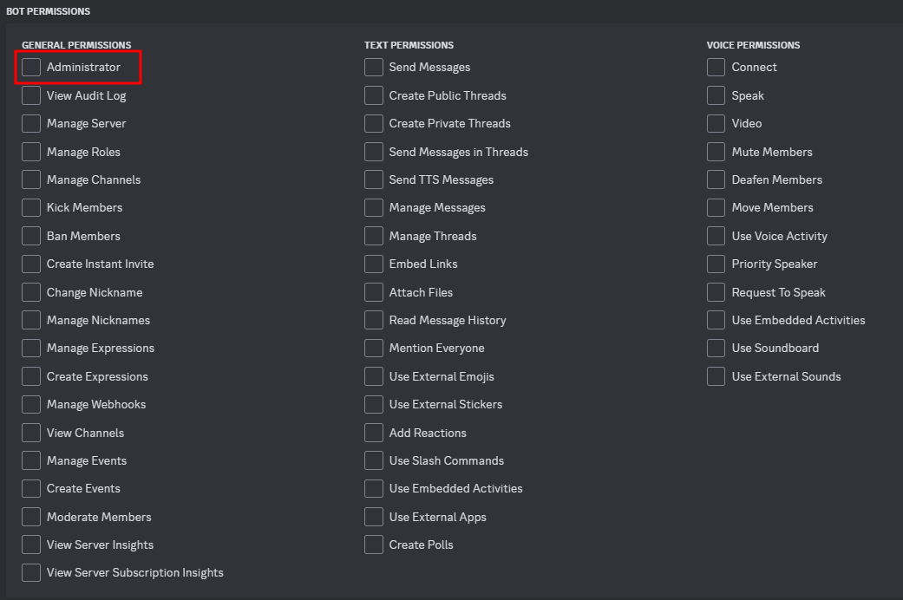
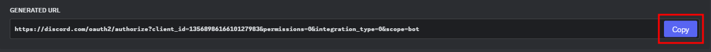
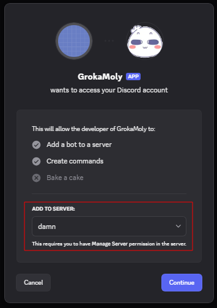
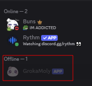
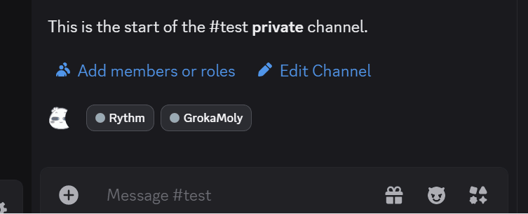

# Setting Up Discord Bot With a Server

**_In this section, We will learn how to invte your Discord bot into your server of choice and test if your Discord bot is operational_**


## Inviting Discord Bot To a Server

1. From current page go to `OAUTH2` page from the left-side bar

    

2. Locate `OAuth2 URL generator` within the page `OAUTH2`

3. Select the `bot` option from `OAuth2 URL generator`

    

4. Select any permission related to what you want your bot to do but for demo we will select `Administrator`

    

5. Find your generated URL for your bot and copy it

    

6. Paste into you prefer browser.

7. After loading the page, it will open discord a prompt you to select your personal server of choice

    

8. After select the your server, yourl bot will now appear in the server member list as offline

    

!!! success "Joined the server"
    Your Discord bot should now be visable in your selected server


## Testing Your Discord Bot Works in Server

1. Make a `Python` file in VSCode

2. Setup up important package for `Python`

    ```
    import discord
    from discord.ext import commands
    ```

3. Initialize prefix for command in Discord server

    ``` 
    bot = commands.Bot(command_prefix='!', intents=discord.Intents.all())
    ```

4. Add a code the displays a ready msg from the Discord bot in the terminal

    ```
    @bot.event
    async def on_ready():
        print(f'Logged in as {bot.user.name} ({bot.user.id})')
        print('------')
    ```

5. Implement a simple command program when your Discord bot will reply with `Pong!`

    ```
    @bot.command()
    async def ping(ctx):
    await ctx.send('Pong!')
    ```

6. Implement a simple program that will reply to the user with a `Hello, @user` and ping to. 

    ```
    @bot.command()
    async def hello(ctx):
    await ctx.send(f'Hello, {ctx.author.mention}!')
    ```

7. Replace `YOUR_TOKEN_HERE` with your Discord bot's token to allow the bot to connect to discord server API

    ```
    bot.run('YOUR_TOKEN_HERE')
    ```

    !!! warning "If token is invalid"
        The program crash on compile

8. When you test it the result should look similar to this below:

    

!!! success "Discord Bot's responds"
    Now your Discord bot will respond to certain commands

## Conclusion

By the end of this section, you will successfully learned the following:

- [x] How to invite a Discord Bot to your server

- [x] How to test basic programs with you Discord Bot

